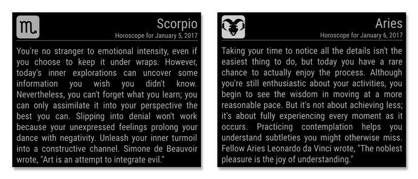

# MMM-horoscope
Horoscope Module for MagicMirror² v.0.1.0


This is a module for [MagicMirror²](https://github.com/MichMich/MagicMirror) that adds daily horoscope pulled from the [Yahoo Style Horoscopes](https://www.yahoo.com/style/horoscope/). API endpoint used for this module is not officially supported and may break at any time.



## Dependencies

npm modules (should already be available with your MM installation):

- request
- moment

## Installation steps

```
cd ~/MagicMirror/modules
git clone https://github.com/morozgrafix/MMM-horoscope.git
cd MMM-horoscope
npm install
```

## Using the module

To use this module, add it to the modules array in the `config/config.js` file:

````javascript
modules: [
  {
    module: 'MMM-horoscope',
    position: 'top_right',  // This can be any of the regions.
    config: {
      // See 'Configuration options' for additional options and more information.
      sign: 'aries', // Zodiac sign
    }
  }
]
````

Since this module is using `node helper` you would need to **restart your MagicMirror** electron app in order for it to be activated.

## Configuration options

<table width="100%">
  <!-- why, markdown... -->
  <thead>
    <tr>
      <th>Option</th>
      <th width="100%">Description</th>
    </tr>
  <thead>
  <tbody>
    <tr>
      <td><code>sign</code></td>
      <td>Zodiac sign for daily horoscope. (String)<br>
        <br>This value is <b>REQUIRED</b><br>
        <br><b>Possible values:</b> <code>aries</code>, <code>taurus</code>, <code>gemini</code>, <code>cancer</code>, <code>leo</code>, <code>virgo</code>, <code>libra</code>, <code>scorpio</code>, <code>sagittarius</code>, <code>capricorn</code>,<code>aquarius</code>,<code>pisces</code>
        <br><b>Default value:</b> <code>aries</code>
      </td>
    </tr>
    <tr>
      <td><code>maxWidth</code></td>
      <td>Overall width of the module to help you fit it in your layout (String CSS value)<br>
        <br><b>Possible values can be specified in:</b> <code>px</code>, <code>%</code>, <code>em</code> etc.
        <br><b>Default value:</b> <code>400px</code>
      </td>
    </tr>
    <tr>
      <td><code>updateInterval</code></td>
      <td>How often does the content needs to be fetched? (Milliseconds)<br>
      	<br>Since we are looking at daily horoscope data doesn't change much it is recommended not to pull it very often. Once an hour should be more than enough.<br>
        <br><b>Possible values:</b> <code>1000</code>-<code>86400000</code>
        <br><b>Default value:</b> <code>3600000</code> (1 hour)
      </td>
    </tr>
    <tr>
      <td><code>timeShift</code></td>
      <td>Shifting time to display next or previous day horoscope. (Milliseconds)<br>
      	<br>This is done for conveniece of displaying next day horoscope in the evening. For example you'd like to start displaying next day horoscope after 7pm, in that case you would need to set <code>timeShift</code> value to <code>18000000</code>. Math works out to <code>24 - 19 = 5</code>, converting 5 hours into milliseconds <code>5 * 60 * 60 * 1000 = 18000000</code><br>
        <br><b>Possible values:</b> <code>0</code>-<code>86400000</code>
        <br><b>Default value:</b> <code>18000000</code> (5 hours)
      </td>
    </tr>
     <tr>
      <td><code>useTextIcon</code></td>
      <td>Display Zodiac sign using text or image for the module output (Boolean)<br>
      	<br>See screenshot: left side is <code>useTextIcon=true</code>, right side is <code>useTextIcon=false</code>. CSS styles are using DejaVu Sans font which should be present on RasPi, other platforms may need CSS stylesheet adjustments.<br>
        <br><b>Possible values:</b> <code>true</code> or <code>false</code>
        <br><b>Default value:</b>  <code>true</code>
      </td>
    </tr>
    <tr>
      <td><code>initialLoadDelay</code></td>
      <td>The initial delay before loading. (Milliseconds)<br>
      <br>Largely Unused. If you have multiple modules that use the same API endpoint, you might want to delay one of the requests.<br>
        <br><b>Possible values:</b> <code>1000</code> - <code>5000</code>
        <br><b>Default value:</b>  <code>0</code>
      </td>
    </tr>
    <tr>
      <td><code>animationSpeed</code></td>
      <td>Speed of the update animation. (Milliseconds)<br>
        <br><b>Possible values:</b><code>0</code> - <code>5000</code>
        <br><b>Default value:</b> <code>2000</code> (2 seconds)
      </td>
    </tr>
  </tbody>
</table>


## Support

This is my very first MM module and I probably missed something obvious. Please get in touch with me if you have a suggestion or feature request. Feel free to file a [GitHub issue](https://github.com/morozgrafix/MMM-horoscope/issues)